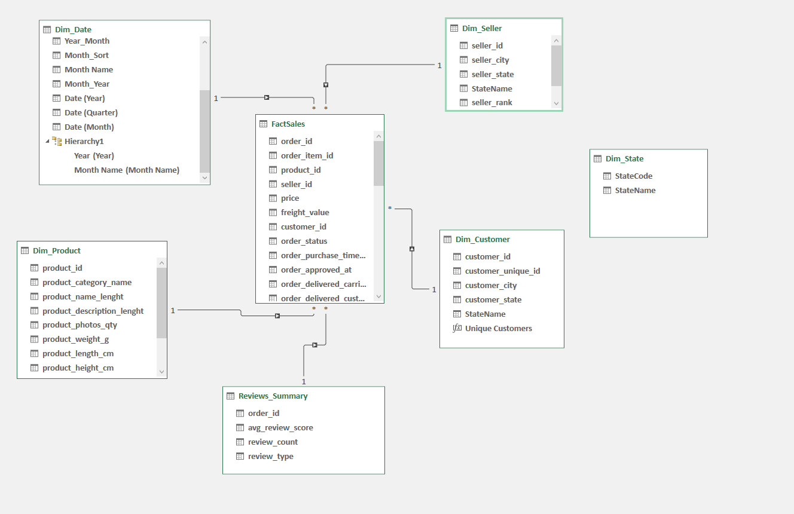

# Olist-Performance-Analysis
Olist Sales Analysis Dashboard --- Excel Power Query & Power Pivot

## Project Overview

This project is an interactive sales and performance analytics dashboard built entirely in Microsoft Excel, using Power Query for data preparation and Power Pivot for data modeling and DAX-based analysis.

The project was designed to answer a practical business question:

### How can sales, product, seller, customer, and delivery data be transformed into actionable insights that support better commercial and operational decisions?

The dashboard combines executive KPIs, time-series analysis, geographic analysis, product/category performance, delivery performance, customer ratings, and seller performance in one interactive analytical view.

## Business Objective

The dashboard is designed to help a business:

* Monitor overall revenue and order performance

* Identify high-performing sellers

* Understand revenue trends over time

* Compare revenue contribution across Brazilian states

* Identify the highest-revenue product categories

* Evaluate delivery performance

* Investigate the relationship between delivery time and customer ratings

* Compare category revenue against customer ratings

* Identify areas with strong performance and areas requiring improvement

The analysis is intended to move beyond simply reporting numbers and provide a structure for identifying performance drivers, opportunities, and potential operational issues.

## Dashboard Highlights

The executive dashboard includes the following KPIs - Revenue, Orders, AOV, Avg. Rating, Avg. Delivery and On-Time Delivery.

The dashboard also contains:

* Revenue Trend by month and year

* Seller Performance table

* Delivery Performance analysis

* Delivery Time vs Customer Rating scatter analysis

* Top 10 States by Revenue

* Top 10 Categories by Revenue

* Revenue as a percentage of total

* Category Performance Matrix

Interactive filters for:

* Year

* Month

* State

* Product Category

The dashboard is designed to update dynamically based on user selections.

## Key Analytical Views

1. Executive KPIs

The dashboard provides a high-level overview of commercial and operational performance through revenue, orders, average order value, customer rating, delivery time, and on-time delivery.

This allows a recruiter or business stakeholder to quickly understand the scale and performance of the business before exploring the detailed analysis.

2. Revenue Trend

The revenue trend visual tracks monthly revenue across 2017 and 2018, helping identify changes in sales performance over time. 2016 has been excluded because of insufficient transaction volume.

3. Seller Performance

The seller scorecard compares: revenue, orders, average rating, average order value, average delivery days, on-time delivery in %.

This creates a multidimensional view of seller performance rather than ranking sellers by revenue alone.

4. Delivery Performance

The dashboard separates deliveries into: on time, delayed and not delivered. 

This connects commercial performance with an important operational KPI.

5. Delivery Time vs Customer Rating

The scatter analysis compares delivery days with customer rating, allowing potential relationships between logistics performance and customer experience to be explored.

6. Geographic Revenue Analysis

The Top 10 States by Revenue visual identifies the largest geographic contributors to sales and displays both revenue and revenue contribution.

7. Category Performance Matrix

The category matrix compares Revenue and Rating to classify categories into four business-performance areas:

* High Revenue / High Rating --- Stars

* High Revenue / Low Rating --- Improve

* Low Revenue / High Rating --- Growth

* Low Revenue / Low Rating --- Low Priority

This framework is intended to support prioritization rather than simply ranking categories.

## Data Preparation --- Power Query

Power Query was used as the data preparation and transformation layer.

The workflow includes preparing the source tables so that they can be loaded into a structured analytical model in Power Pivot.

Key data preparation activities include:

* Cleaning and structuring source data

* Preparing dimension and fact tables

* Standardizing fields used for analysis

* Creating summarized review data

* Preparing date-related fields

* Creating category groupings for dashboard analysis

* Preparing fields required for relationships and DAX calculations

* Loading the transformed tables into the Power Pivot Data Model

The objective was to separate data preparation from analysis and visualization, creating a more maintainable workflow than building the dashboard directly from raw data.

## Data Model / Schema --- Power Pivot

The project uses a structured Power Pivot data model with `FactSales` as the central transactional table and supporting dimension tables.

| Table | Purpose | Key fields |
|---|---|---|
| **FactSales** | Central sales transaction table | `order_id`, `product_id`, `seller_id`, `customer_id`, `price`, `freight_value`, order dates |
| **Dim_Date** | Time-based analysis | Year, Quarter, Month, Date |
| **Dim_Product** | Product and category analysis | `product_id`, `product_category_name` |
| **Dim_Seller** | Seller performance | `seller_id`, `seller_city`, `seller_state`, `seller_rank` |
| **Dim_Customer** | Customer and geographic analysis | `customer_id`, `customer_unique_id`, `customer_state` |
| **Reviews_Summary** | Customer satisfaction analysis | `order_id`, `avg_review_score`, `review_count` |
| **Dim_State** | State reference | `StateCode`, `StateName` |

### Power Pivot Data Model

The following diagram shows the relationships between the central
`FactSales` table and the supporting tables.

The model separates descriptive attributes from transactional sales data, which makes it easier to build reusable measures and interactive reports.

## Power Pivot / DAX

Power Pivot was used to create analytical measures and calculations for the dashboard.

The model supports calculations such as:

* Total Revenue

* Total Orders

* Average Order Value

* Average Rating

* Average Delivery Days

* On-Time %

* Revenue % of Total

* Seller ranking

* Category performance

* Delivery performance

The use of measures allows dashboard calculations to respond to filters and slicers instead of relying on hard-coded values.

## Interactivity

One of the main objectives of the project is to demonstrate interactive data visualization, rather than creating a static Excel report.

Users can filter the dashboard by year, month, state and product category. 

The visuals and KPIs update based on the selected filter context.

